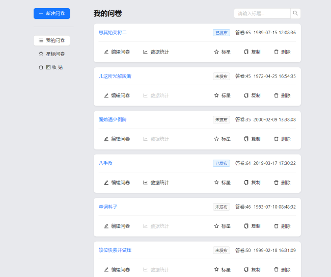
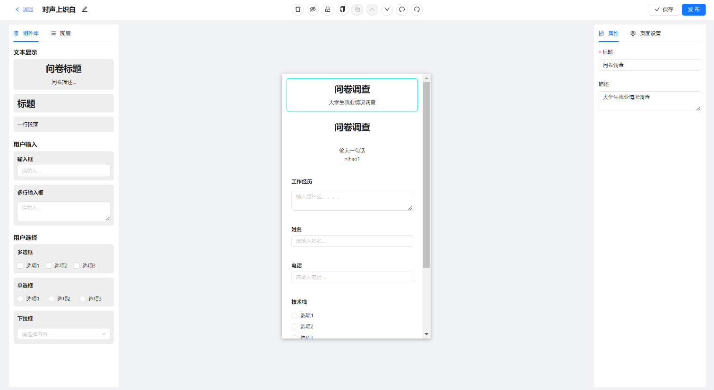
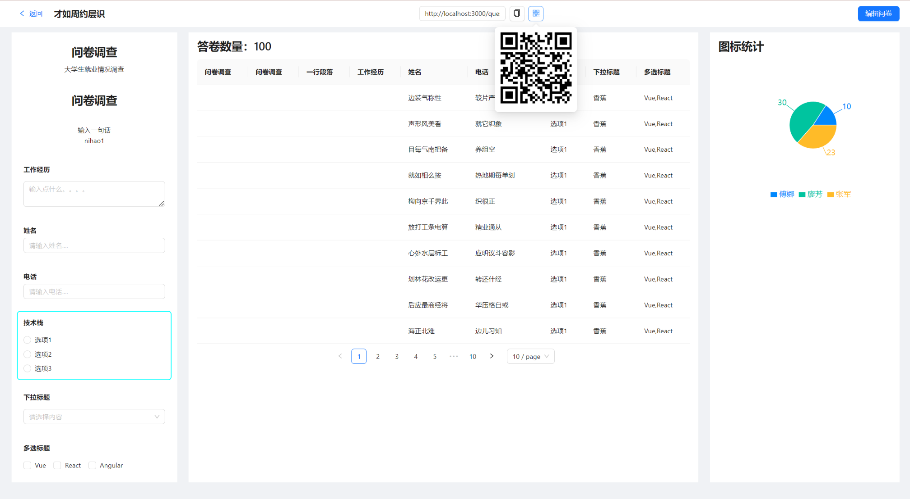

# <div align=center>调查宝</div>
<div align=center>
<p >

    


</p>

<p>

 


</p>

</div>

调查宝是一个在线问卷调查平台，提供简单、高效的调查制作、发布和数据分析服务。它允许用户通过拖放式编辑器轻松创建定制的问卷，支持多种题型，包括单选、多选、填空等。用户可以通过链接或二维码分享的形式将问卷分享到社交媒体、电子邮件或网站上，以便收集数据。


## ✨特性
- 问卷回收站软删除
- 创建编辑问卷
- 组件的拖拽
- 快捷键的支持
- 问卷发布和填写
- 单个选项统计

## 🖼️预览图






## 🎈使用

```bash
## 安装依赖
pnpm install

## 启动项目
pnpm run dev
```
